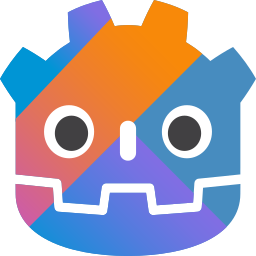

# godot-kotlin

NOTICE: Project is being merged at [utopia-rise/godot-kotlin](https://github.com/utopia-rise/godot-kotlin). No further development will be done in this repository.

Kotlin Native bindings for Godot.

Documentation is available at [godot-kotl.in](https://godot-kotl.in).

## Versioning
Checkout the [documentation](https://godot-kotl.in) for information about how this project is versioned.
